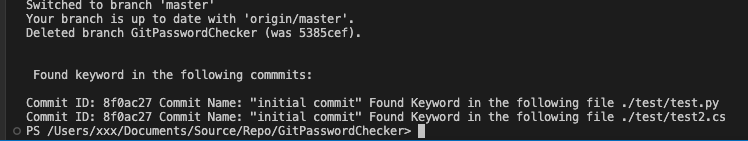
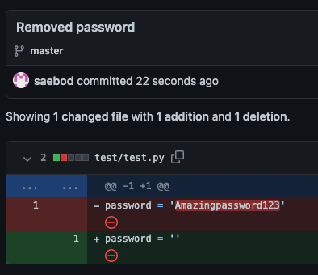

# GitPasswordChecker

This project scans all previous commits to find passwords/keys/tokens that are entered in the keyword.txt file.

## Motivation

This project is motived by the fact that we are all humans and forget to remove passwords from previous commits when we start out projects.

## How To Use

### Add the folder *GitPasswordChecker* to your project    .
    .
    ├── Repofolder1 
    ├── RepofolderN 
    ├── Yourscriptx.py 
    ├── GitPasswordChecker                    # Added to your repo
    │   ├── main.py          
    │   ├── Keywords.txt          # Insert your keywords here

### Enter the keywords
Enter the keywords that you want to look for in the txt file GitPasswordChecker/Keywords.txt (The scripts will empty the txt file when it is done.). 
> Seperate your keywords with a comma Eg. *Password1,Password2*

### Run the script
Run the GitPasswordChecker/main.py from the root of your repo.

    .# Run the GitPasswordChecker/main.py from the root of your repo
    ├── Repofolder1 
    ├── RepofolderN 
    ├── Yourscriptx.py 
    ├── GitPasswordChecker                    # Added to your repo
    │   ├── main.py          
    │   ├── Keywords.txt          # Insert your keywords here

## How does it work?

1. The script will start by looking at the GitPasswordChecker/Keywords.txt file and list the key words. If the list is empty then the script will exit.
2. Creates a new locale branch which it will checkout to.
3. Checks if there is a .gitignore file, if not it will create one
4. Adds the folder GitPasswordChecker to .gitignore
5. Collects a lists of all commits that has been made to the project.
6. For each commit the script will open all files and try to see search for the keywords.
7. if it finds the keyword it will append the details to a list
8. When the script has been looped over all commits it will go back to the initial branch and delete the local branch that were created in step 2.
9. The script will finish with printing a lists of commit details of where it found the keywords.